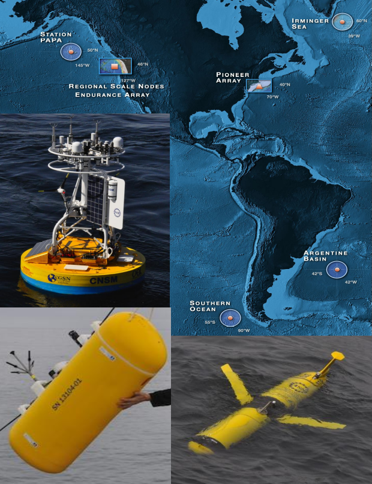

<!-- #region -->
# OOI Carbon System: Data Validation for the Irminger Sea Array

#### Author: Andrew Reed

---
### Background

#### Ocean Observatories Initative
The Ocean Observatories Initiative (OOI) is an NSF-funded project for long-term (25 years) infrastructure for ocean observations. There are three main elements of OOI: (1) The Regional Cabled Array off the coast of Washington; (2) the Endurance Array on the Oregon-Washington shelf; and (3) the Coastal & Global Scale Nodes with mooring arrays in the Irminger Sea (Irminger Sea Array), at Ocean Station Papa (Papa Array), in the Southern Ocean and Argentine Basin (descoped and no longer collecting data), and at the New England Shelf (Pioneer Array-NES). 

<figure>

<figcaption align = "center"><b>Figure 1: Map of the OOI Arrays with (closewise from bottom right) a glider, a wire-following profiler, and a coastal surface mooring.</b></figcaption>
</figure>

OOI deploys several differrent instruments which measure pH and pCO<sub>2</sub> at the arrays in the open ocean and coastal locations. Seawater pCO<sub>2</sub> is measured in the surface ocean seawater and atmosphere with the Pro-Oceanus CO2-Pro ATM and in the water column with the Sunburst SAMI-CO2. Seawater pH is measured with the Sunburst SAMI-pH sensor. These sensors have now been deployed, depending on location, for up to 8 years. 

Additionally, OOI collects water samples during each deployment and recovery of each instrument on the moorings, and have them analyzed for a full-suite of parameters. Analysis include oxygen, salinity, nutrients (nitrate, nitrite, ammonium, phosphate, silicate), chlorophyll, and carbon system.

#### Global Irminger Sea Array
This analysis makes use of the carbon system datasets from the Global Irminger Array (60$^{\circ}$N, 39$^{\circ}$W). The Global Irminger Array is composed of four moorings arrayed in a triangle. At the Apex are a hybrid profiling mooring and an Apex Surface Mooring. At the other two vertices are two subsurface moorings, Flanking Moorings A & B. The profiling mooring does not have any carbon system instruments. The Flanking Moorings each have a Sunburst SAMI-pH located at 30 m depth. The Surface Mooring has a Pro-Oceanus CO2-Pro ATM on the surface mooring, Sunburst SAMI-CO2 instruments at 12 m, 40 m, 80 m, and 130 m depth, and Sunbrust SAMI-pH at 20 m and 100 m depth.

<figure>

<figcaption align="center"><b>Figure 2: Schematic of an OOI Global Array mooring arrangement.</b></figcaption>
</figure>

---
### Motivation


---
### Data

#### Bottle Data
These are discrete water samples collected via Niskin Bottle casts during deployment and recovery of the moored instrumentation. The data is downloaded from OOI Alfresco website as excel files. Parameters sampled include oxygen, salinity, nutrient concentrations (phosphate, nitrate, nitrite, ammonium, silicate), chlorophyll concentrations, and the carbon system. The carbon system parameters sampled are Total Alkalinity (TA), Dissolved Inorganic Carbon (DIC), and pH. These data have been prepared using the **```Bottle_Data```** notebook.

#### Deployment Information
For each instrument reference designator, we can get much more detailed information on the deployment numbers, deployment and recovery times, as well as  for a particular reference designator by requesting the deployment information from OOINet. The Deployment information contains the relevant latitude, longitude, and deployed depth information needed to match bottle data with the instrument data.

#### Annotations
Annotations are Human-in-the-loop assessments which provide information on data quality, performance, technical inssues, and context for a given reference designator. They are added by the array operators for specified time periods. Furthermore, they may also be flagged with a "quality flag" indicating if the data should be discarded. Annotations are downloaded right from the OOI data portal as a json file by reference designator and date.

#### PHSEN 
These are the Sunburst Sensors, LLC. SAMI-pH sensor. It is calibrated for pH values from 70-9.0 pH units for salinities from 25-40 psu. Manufacturers stated accuracy of 0.003 pH units, precision < 0.001 pH units, and long-term drift of < 0.001 pH units / 6 months. The data is downloaded from the Ocean Observatories data portal (OOINet) as netCDF files and have been prepared using the **```Identify_and_Download```** notebook. The **```PHSEN```** datasets from Irminger which are used in this notebook are:

| Instrument | Reference Designator | Mooring | Depth | Associated CTD Reference Designator |
| ---------- | -------------------- | ------- | ----- | ----------------------------------- |
| PHSEN      | GI01SUMO-RII11-02-PHSENE041 | Apex Surface Mooring | 20 m | GI01SUMO-RII11-02-CTDMOQ011 |
| PHSEN      | GI01SUMO-RII11-02-PHSENE042 | Apex Surface Mooring | 100 m | GI01SUMO-RII11-02-CTDMOQ013 |
| PHSEN      | GI03FLMA-RIS01-04-PHSENF000 | Flanking Mooring A | 30 m | GI03FLMA-RIM01-02-CTDMOG040 |
| PHSEN      | GI01SUMO-RII11-02-CTDMOQ013 | Flanking Mooring B | 30 m | GI01SUMO-RII11-02-CTDMOQ013 |

#### PCO2W 
These are the Sunburst Sensors, LLC. SAMI-CO<sub>2</sub> sensor. It is calibrated for pCO<sub>2</sub> concentrations from 200 - 1000 ppm or 1200 ppm. Manufacturers stated accuracy of 3 ppm, precision < 1 ppm, and long-term drift of < 1 ppm / 6 months. The data is downloaded from the Ocean Observatories data portal (OOINet) as netCDF files and have been prepared using the **```Identify_and_Download```** notebook. The **```PCO2W```** datasets from Irminger which are used in this notebook are:

| Instrument | Reference Designator | Mooring | Depth | Associated CTD Reference Designator |
| ---------- | -------------------- | ------- | ----- | ----------------------------------- |
| PCO2W      | GI01SUMO-RID16-05-PCO2WB000 | Apex Surface Mooring | 12 m | GI01SUMO-RID16-03-CTDBPF000 |
| PCO2W      | GI01SUMO-RII11-02-PCO2WC051 | Apex Surface Mooring | 40 m | GI01SUMO-RII11-02-CTDMOQ031 |
| PCO2W      | GI01SUMO-RII11-02-PCO2WC052 | Apex Surface Mooring | 80 m | GI01SUMO-RII11-02-CTDBPP032 |
| PCO2W      | GI01SUMO-RII11-02-PCO2WC053 | Apex Surface Mooring | 130 m | GI01SUMO-RII11-02-CTDBPP033 |

#### PCO2A
This is the Pro-Oceanus CO2-Pro ATM sensor. It measures both surface ocean and atmospheric pCO<sub>2</sub> concentrations. The data is downloaded from the Ocean Observatories data portal (OOINet) as netCDF files and have been prepared using the **```Identify_and_Download```** notebook. There is a single **```PCO2A```** dataset from the Irminger Array Apex Surface Mooring:

| Instrument | Reference Designator | Mooring | Depth | Associated CTD Reference Designator |
| ---------- | -------------------- | ------- | ----- | ----------------------------------- |
| PCO2A      | GI01SUMO-SBD12-04-PCO2AA000 | Apex Surface Mooring | Surface | GI01SUMO-SBD12-06-METBKA000 |

#### CTDBP
These are the collocated SeaBird CTDs with the **```PHSEN```** and **```PCO2W```** datasets. This is because the carbon system datasets from OOI are not delivered with temperature (T), salinity (S), pressure (P), or density ($\rho$) needed to compare with the bottle data hydrographic parameters. Additionally, the salinity data is used as an input for calculating the pH from the SAMI-pH. The data is downloaded from the Ocean Observatories data portal (OOINet) as netCDF files and have been prepared using the **```Identify_and_Download```** notebook. The **```CTD```** datasets are identified in the tables above with their associated carbon system instrument.

---
### Methods

#### Bottle Data
First, the Irminger Sea Bottle data (which has been prepared using the **```Bottle_Data```** notebook) are loaded into a pandas dataframe, the bad samples are dropped, and the data filtered for only the samples with carbon system measurements.

#### Dataset Preparation
Now we want to load the carbon system dataset which has been prepared using **```Identify_and_Download```** notebook and integrate the associated **annotations** and **CTD** data. We first request the annotations associated with the given dataset and add them to the dataset. After incorporating the annotations, we next load the associated CTD data. The CTD dataset T, S, P, and $\rho$ are interpolated to the dataset time base and merged into the dataset using ```ds.interp_like```.

#### Quality Checks
Finally, we want to filter the data for bad or questionable data. This is done utilizing the python modules for either PCO2W and PHSEN written by Chris Wingard of OOI (Endurance Array - Oregon State University) adapted from code developed by Sunburst Sensors, LLC. These filters involve an assessment of the raw data and the calculated seawater pH for quality, returning a susbset of the QARTOD flags to indicate the quality. QARTOD flags used are:

        1 = Pass
        3 = Suspect or of High Interest
        4 = Fail

Suspect flags are set based on experience with the instrument and the data produced by it. Failed flags are based on code provided by the vendor. The final flag value represents the worst case assessment of the data quality.

#### Sample Matching
Now, we want to identify the Bottle Data which corresponds to the instrument datasets and match the bottle data to the instrument data. First, we request the deployment information for a given instrument dataset in order to get the latitude, longitude, and depth of the instrument. Then, we filter the bottle data for those samples which were collected within 5 km horizontally and 15 m vertically of the instrument data. 

Finally, we generate a table that directly compares the bottle data with the instrument data. We do this by first iterating over each row of the identified bottle data. For each bottle sample, we then take an average of the instrument data which occured within a week of the bottle sample. We save that data in a dataframe along with the associated sample window, deployment number, and important hydrographic parameters (temperature, salinity, pressure).
<!-- #endregion -->

```python

```
