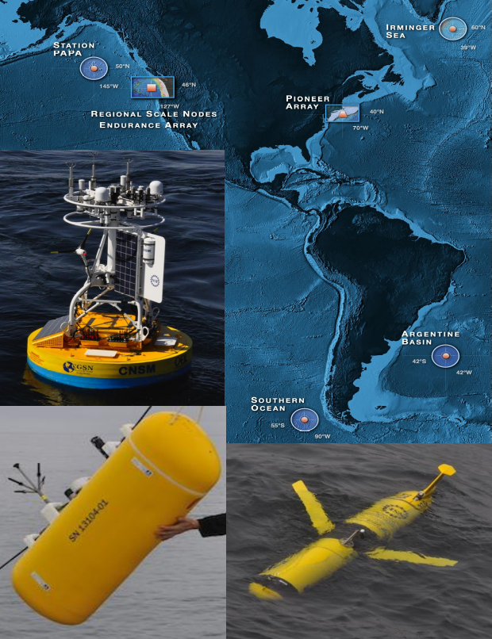
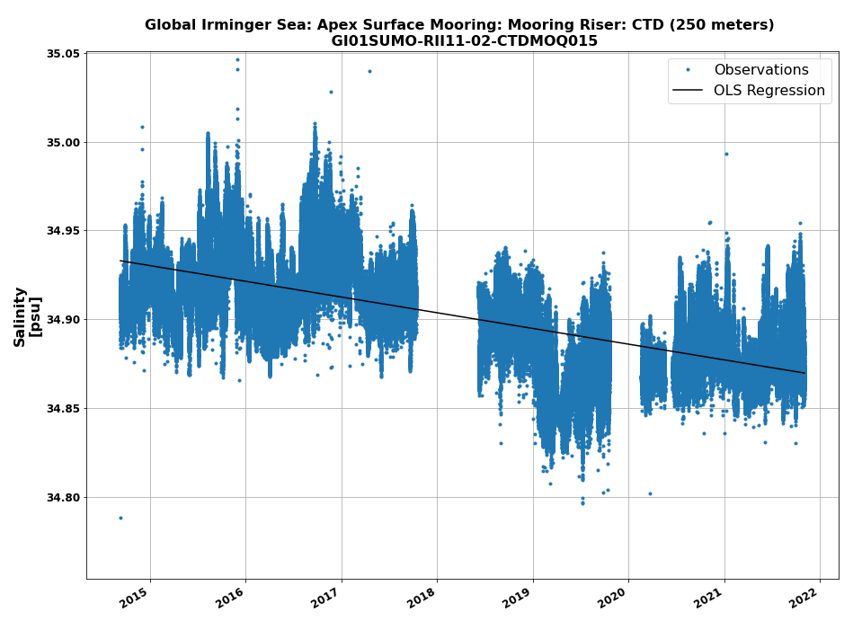
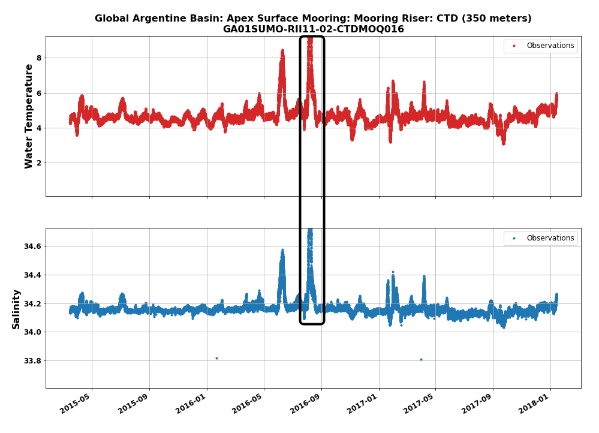
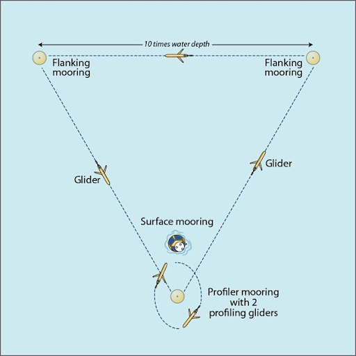

<!-- #region -->
# QARTOD in Practice: Two Examples from the Ocean Observatories Initative
#### Author: Andrew Reed

---
### Background

#### Ocean Observatories Initative
The Ocean Observatories Initiative (OOI) is an NSF-funded project for long-term (25 years) infrastructure for ocean observations. There are three main elements of OOI: (1) The Regional Cabled Array off the coast of Washington; (2) the Endurance Array on the Oregon-Washington shelf; and (3) the Coastal & Global Scale Nodes with mooring arrays in the Irminger Sea (Irminger Sea Array), at Ocean Station Papa (Papa Array), in the Southern Ocean and Argentine Basin (descoped and no longer collecting data), and at the New England Shelf (Pioneer Array-NES). 

<figure>

<figcaption align = "center"><b>Figure 1: Map of the OOI Arrays with (closewise from bottom right) a glider, a wire-following profiler, and a coastal surface mooring.</b></figcaption>
</figure>


#### QARTOD
As part of the ongoing OOI effort to improve data quality, OOI is implementing Quality Assurance of Real-Time Oceanographic Data (QARTOD) tests on an instrument-by-instrument basis. Led by the United States Integrated Ocean Observing System (U.S. IOOS), the QARTOD effort draws on the ocean observing community to provide manuals, which outline and identify tests to evaluate data quality by variable and instrument type (https://ioos.noaa.gov/project/qartod/). Currently, OOI is focused on implementing the Gross Range and Climatology Tests for the variables associated with CTD, pH and pCO2 sensors. Over the coming months tests will be applied to data collected by pressure sensors, bio-optical sensors, and dissolved oxygen sensors. Ultimately, where and when appropriate, QARTOD tests will be applied to the relevant variables for all OOI sensors.

##### Gross Range Test
The Gross Range test aims to identify data that fall outside either the sensor’s measurement range or is a statistical outlier. OOI identifies failed/bad data with a threshold value based on the calibration range for a given sensor. We also calculate suspicious/interesting data thresholds as the mean ± 5 standard deviations based on the historical OOI data for the variable at the deployed location. Thus, as implemented by OOI, the Gross Range test identifies data which either falls outside of the sensor calibration range, and is thus “bad”, or data that are statistical outliers based on the historic OOI data for that location.

##### Climatology Test
The Climatology Test is a variation on the Gross Range Test, modifying the relevant suspicious/interesting data thresholds for each calendar-month by accounting for seasonal cycles. The OOI time series are short (less than 8 years) relative to the World Meteorological Organization (WMO) recommended 30-year climatology reference period. We therefore calculate seasonal cycles for a given variable using harmonic analysis, a method that is less susceptible to spurious values that can arise either from data gaps, measurement errors or from the presence of real, but anomalous, geophysical conditions in the 8-year record.  First, we group the data by calendar-month (e.g. January, February, …, December) and calculate the average of each month. Then, the monthly-averaged-data are fit with a two-cycle (annual plus semiannual) harmonic model using ordinary-least-squares. This produces a “climatological” fit for each calendar-month. Next, we calculate the standard deviation for each calendar-month from the climatological-fit and the grouped observations for the month. The thresholds for suspicious/interesting data are set as the climatological-fit ± 3 standard deviations. Occasionally, data gaps may mean that there are no historical observations for a given calendar-month. In these instances, we linearly interpolate the threshold from the nearest months. For sensors mounted on profiler moorings or vehicles, we first subset the data into a series of standardized depth bins to account for differences in seasonality and variability at different depths in the water column. The resulting test identifies data that fall outside of typical seasonal variability determined from the historic OOI data for that location.

---
### Motivation
The goal is to assess how well OOI's approach for QARTOD performs for quality control of OOI's timeseries data. 

This is done by comparing the performance of the implemented Gross Range and Climatology tests against two test cases of natural phenomena. The first test case is the freshening of the mid-water-column in the Irminger Sea. CTDs across the Global Irminger Sea have documented a continous long term freshening of the water column from the near surface through 1500 m depth that is captured on all the deployed moorings. We use this freshening to investigate how well the fitting of the gross range threshold performace relative to a long-term trend, and that it is not inappropriately flagging natural variability.

<figure>

<figcaption align = "center"><b>Figure 2: Seawater salinity at the Irminger Apex Surface Mooring CTD located at 250 m depth with the freshening signal (black line). </b></figcaption>
</figure>

The second test case is the passage of mid-water-column eddy across the Global Irminger Array in July-August 2016. The passage of the eddy is visible as a large warm and saline deviation in the temperature and salinity data of the deployed CTDs. This allows us to test how well does the climatology fitting algorithm respond to a large deviation in the data and if it sufficiently flags the physical phenomena of the eddy with its flags.

<figure>

<figcaption align = "center"><b>Figure 3: Seawater temperature (top) and salinity (bottom) at the Apex Surface Mooring CTD located at 350 m depth. The eddy is highlighted in the black box.</b></figcaption>
</figure>

#### Arrays
##### Global Argentine Basin
The Global Argentine Basin was an OOI maintained array of surface, subsurface, and profiling moorings in the Argentine Basin of the South Atlantic at (42$^{\circ}$S, 42$^{\circ}$W) from 2015 to 2018. The mooring arrangement can be seen in this schematic: 


<figure>

<figcaption align="center"><b>Figure 4: Schematic of an OOI Global Array mooring arrangement.</b></figcaption>
</figure>
    

The Surface Mooring located at the Apex and the two Flanking Moorings were equipped with CTDs are regularly spaced intervals up to 1500 m of depth. Additionally, the CTDs were placed at the same nominal depths on all three moorings below 30 m of depth.

#### Global Irminger Sea
The Global Irminger Sea Array is an OOI maintained array of surface, subsurface, and profiling moorings in the Irminger Sea of the North Atlantic at (60$^{\circ}$N, 39$^{\circ}$W) from 2014 to present. The mooring arrangement and instrumentation are the same as that for the Argentine Basin Array 

---
### Methods

First, I use the following procedure for identifying the relevant CTD datasets from the OOI Argentine Basin Array moorings or the Global Irminger Sea Array moorings. The OOI API is pinged for available datasets as well as their common (or "English") names using the **```OOINet```** module hosted at https://github.com/reedan88/OOINet as well as some functions from https://github.com/oceanobservatories/ooi-data-explorations. In order to access and download data from OOI via the API, you MUST register at https://ooinet.oceanobservatories.org and save your **username** and **api token** in a yaml (or similar) file. Additionally, the **vocab** is requested for each dataset in order to get the deployed depth of a given dataset and merged with the datasets.

With all of the possible CTD datasets identified, I next want to download the data. For this project I utilize the data hosted on the OOI Data Explorer ERDDAP server (https://erddap.dataexplorer.oceanobservatories.org/erddap). These data are accessed and loaded into xarray dataset object using the **```ERDDAPY```** package. Data Explorer is chosen as the data source over the OOI API because the datasets are the most complete available and come with only the prinicple science parameters (i.e. seawater temperature, salinity, etc) as dataset data variables and without the less-processed raw data. 

However, datasets downloaded from Data Explorer do not come with the deployment information as a data variable, unlike datasets downloaded from the OOI Data Portal (ooinet.oceanobservatories.org). Since deployment information can be a valuable diagnostic tools, we step through adding deployment information to the ERDDAP dataset by requesting the deployment times from the Data Portal via the OOI API.

Once the CTD datasets are prepared, we calculate the applicable thresholds for the gross range and climatology test inputs for the seawater temperature and salinity as outlined in the **Background** section. With the input thresholds calculate, we apply the gross range and climatology tests. The test are implemented using the **```ioos_qc```** package (https://github.com/ioos/ioos_qc). Each test returns a "flag" for each data point based on the relevant test thresholds with the following definitions:
* 1 = good
* 2 = not tested
* 3 = suspect OR interesting
* 4 = bad
* 9 = missing
<!-- #endregion -->

```python

```
